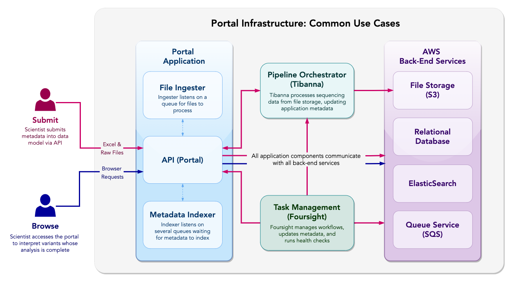

Dataflow Overview
=======================================

Figure 1: CGAP Dataflow Diagram. This diagram illustrates the data upload and data browse use cases and how that data flows through the system and which infrastructure components communicate. Note that file uploads are federated via pre-signed URL then uploaded directly to S3.
